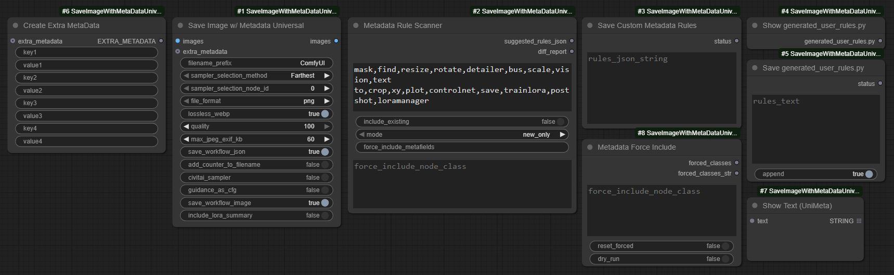

## ComfyUI-SaveImageWithMetaDataUniversal（日本語版）

> Automatic1111 互換 / Civitai 互換の拡張メタデータ取得機能を強化し、プロンプトエンコーダ、LoRA & モデルローダ、埋め込み、サンプラー、CLIP、ガイダンス、シフト等を幅広くカバーします。

- 元リポジトリ [ComfyUI-SaveImageWithMetaData](https://github.com/nkchocoai/ComfyUI-SaveImageWithMetaData/) を大幅に再設計し、**可能な限りあらゆるカスタムノードパックを自動サポート** することを目標としています（いくつかは明示的サポートあり）。
- `Save Image w/ Metadata Universal` ノードは、任意のノード入力値からプロンプト/モデル/LoRA/ハッシュ等を自動抽出し画像にメタデータを埋め込みます（追加配線不要）。
- ワークフローとメタデータの WebP 埋め込みを完全サポート。
- JPEG へも保存可能（64KB EXIF 制限内）。超過時は段階的フォールバックを実行。
- モデルハッシュを `.sha256` にキャッシュし一度計算すれば再ハッシュ不要で高速化。
- `Metadata Rule Scanner` と `Save Custom Metadata Rules` が全インストールノードを走査しキャプチャルールを自動生成。ヒューリスティック不能ノードは安全にスキップ。
- 動的生成ルールにより多くのカスタムノード出力値をメタデータ化可能。
- 動作確認: SD1.5 / SDXL / FLUX / QWEN / WAN (2.1) / GGUF / Nunchaku

## 目次
* 入門
	* [クイックスタート](#クイックスタート)
	* [形式とフォールバックの早見](#形式とフォールバックの早見)
	* [ファイル名トークン一覧](#ファイル名トークン一覧)
* コア機能
	* [ノード一覧](#ノード一覧)
	* [機能概要](#機能概要)
	* [ノード UI パラメータ](#ノード-ui-パラメータ主要追加項目)
	* [サンプラー選択方法](#サンプラー選択方法)
	* [取得されるメタデータ](#取得されるメタデータ)
* メタデータ & エンコード
	* [JPEG メタデータサイズとフォールバック挙動](#jpeg-メタデータサイズとフォールバック挙動)
	* [メタデータルールツール](#メタデータルールツール)
* 上級 / パワーユーザ
	* [環境変数フラグ](#環境変数フラグ)
	* [パラメータ文字列フォーマットモード](#パラメータ文字列フォーマットモード)
	* [順序保証](#順序保証)
* リファレンス & サポート
	* [トラブルシュート / FAQ](#トラブルシュート--faq)
	* [設計 / 今後のアイデア](#設計--今後のアイデア)
	* [変更履歴](#変更履歴)
	* [貢献について](#貢献について概要)
	* [AI アシスタント指針](.github/copilot-instructions.md)

## 注記
- 個人レベルの開発者です。規模拡大に伴い Copilot を併用しています。
- 質問・不足ドキュメント・特定ワークフロー/カスタムパックでの問題は Issue を作成してください。
- リファクタ通知: 旧モノリシックモジュールは削除。新しい直接 import パスは [変更履歴](#変更履歴) 参照。

## インストール
```
cd <ComfyUIディレクトリ>/custom_nodes
git clone https://github.com/xxmjskxx/ComfyUI_SaveImageWithMetaDataUniversal.git
```

## クイックスタート
1. `Metadata Rule Scanner` + `Save Custom Metadata Rules` でキャプチャルールを生成 & 保存（例: `example_workflows/scan-and-save-custom-metadata-rules.json`）。
2. `Save Image w/ Metadata Universal` を追加し画像入力へ接続してカスタムルールに基づき保存。
3. （任意）`Create Extra MetaData` で追加メタ情報を記録。
4. （任意）A1111 / Civitai 互換性を最大化するには `civitai_sampler` と `guidance_as_cfg` をオン。
5. ワークフロー完全埋め込みが必要な場合は PNG / 可逆 WebP を推奨（JPEG はサイズ制限—[下記参照](#形式とフォールバックの早見)）。
6. ノードパラメータへホバーすると簡潔ツールチップ（フォールバック段階 / `max_jpeg_exif_kb` / LoRA サマリ / guidance→CFG / サンプラー命名 / ファイル名トークン）。詳細: [ノード UI パラメータ](#ノード-ui-パラメータ主要追加項目), [JPEG メタデータサイズとフォールバック挙動](#jpeg-メタデータサイズとフォールバック挙動), 高度な調整: [環境変数フラグ](#環境変数フラグ)。

## ノード一覧
| ノード | 目的 |
| ---- | ---- |
| `SaveImageWithMetaDataUniversal` | 画像保存 + メタデータ生成 (PNGInfo / EXIF) & パラメータ文字列。 |
| `Create Extra MetaData` | 任意の追加キー/値メタデータ挿入。 |
| `Metadata Rule Scanner` | インストール済みノードを走査しキャプチャルール候補生成。 |
| `Save Custom Metadata Rules` | 生成ルールを `generated_user_rules.py` に保存（追記/上書き）。 |
| `Show generated_user_rules.py` | マージ済みユーザルール内容表示/編集。 |
| `Save generated_user_rules.py` | 編集テキストを検証しユーザルールへ書込。 |
| `Metadata Force Include` | 強制含有ノードクラス名を設定。 |
| `Show Text (UniMeta)` | 接続テキスト出力表示（ローカル派生版）。 |
| `Show Any (Any to String)` | 任意値を文字列化して表示; `Create Extra MetaData` へ整数/浮動小数等を接続する用途。 |

## 機能概要
* Automatic1111 形式 / Civitai 互換の単一行パラメータ文字列（`METADATA_TEST_MODE=1` でテスト用複数行）。
* PNG + 可逆 WebP でワークフロー & メタデータ埋め込み。JPEG は 64KB EXIF 制限下で段階的フォールバック。
	* 詳細: [docs/JPEG_METADATA_FALLBACK.md](docs/JPEG_METADATA_FALLBACK.md)
* Wan 2.1 例: [example_workflows/wan21_text_to_image.json](example_workflows/wan21_text_to_image.json)（複合スケジューラ入力解析・VAE decode・拡張メタ保存）。
* 動的ルール生成: `Metadata Rule Scanner` + `Save Custom Metadata Rules`で広範なカスタムパックをカバー。
* LoRA 処理:
	* 単体/スタックローダ & インライン `<lora:name:sm[:sc]>` タグ（Prompt Control / LoRA Manager 等）検出。
	* 集約サマリ行 `LoRAs: name(str_model/str_clip)` + 個別詳細（ハッシュと強度はサマリ無効化時も保持）。
* 複数プロンプトエンコーダ対応（Flux T5 + CLIP 等）で冗長統合ポジティブ抑制。
* 埋め込み解決 & ハッシュ、`.sha256` サイドカーキャッシュで再計算削減。
* `guidance_as_cfg` による Guidance→CFG 置換、サンプラー命名最小正規化。
* `Create Extra MetaData` で手動メタ追加（例: `example_workflows/extra_metadata.json`）。
* ハッシュ詳細抑制 (`METADATA_NO_HASH_DETAIL`) / LoRA サマリ抑制 (`METADATA_NO_LORA_SUMMARY` または UI) の選択的冗長度。
* 再現性向上の安定順序出力。
* 環境フラグはランタイム評価（再起動不要）。
	* 一覧: [環境変数フラグ](#環境変数フラグ)
* JPEG フォールバック発生時は `Metadata Fallback: <stage>` を末尾トークンとして付与。
* 多くのカスタムノードパックでそのまま良好に動作（主観的テスト範囲）。

## 形式とフォールバックの早見
* JPEG vs PNG/WebP: JPEG は ~64KB EXIF 制限。大規模ワークフローは段階的トリム（[詳細](#jpeg-メタデータサイズとフォールバック挙動)）。長期保存は PNG / 可逆 WebP。
* JPEG 試行サイズ制御: `max_jpeg_exif_kb` (既定60, 最大64) は EXIF 書込上限。超過でフォールバック段階へ。
* フォールバック検知: パラメータ末尾が `Metadata Fallback: <stage>` ならトリム発生（`reduced-exif` / `minimal` / `com-marker`）。[フォールバック段階](#フォールバック段階--インジケータ)。
* LoRA サマリ行: `include_lora_summary` で切替。無効時は個別 `Lora_*` のみ。

## サンプラー選択方法
- このノードより前に実行された KSampler を選定。
- **Farthest** 最も遠い KSampler。
- **Nearest** 最も近い KSampler。
- **By node ID** 指定 ID の KSampler。

## 取得されるメタデータ
- Positive prompt
- Negative prompt
- Steps / Sampler / Scheduler
- CFG Scale / Guidance / Denoise
- Shift, max_shift, base_shift
- Seed / Clip skip / Clip model / Size
- Model / Model hash
- VAE / VAE hash （保存ノード入力から参照）
- LoRAs (名前 / ハッシュ / 強度 model/clip)
- Embeddings (名前 / ハッシュ)
- バッチ (batch size >=2 の場合 index / size)
- Hashes (Model / LoRAs / Embeddings) — [Civitai](https://civitai.com/) 用

## ノード UI パラメータ（主要追加項目）
主要な操作性 & 互換性パラメータ:

* `include_lora_summary` (BOOLEAN 既定 True): 集約 `LoRAs:` 行を出力。False で個別のみ。UI が環境変数より優先。
* `guidance_as_cfg` (BOOLEAN 既定 False): `Guidance` を `CFG scale` に転写し独立 `Guidance:` を省略（A1111 / Civitai 近似）。
* `max_jpeg_exif_kb` (INT 既定 60 / 最小4 / 最大64): JPEG EXIF 試行上限。超過で段階的フォールバック（reduced-exif → minimal → com-marker）。大規模は PNG / 可逆 WebP 推奨。

---
### ファイル名トークン一覧
| トークン | 置換内容 |
|-------|----------|
| `%seed%` | Seed 値 |
| `%width%` | 画像幅 |
| `%height%` | 画像高さ |
| `%pprompt%` | Positive prompt 全体 |
| `%pprompt:[n]%` | Positive prompt 先頭 n 文字 |
| `%nprompt%` | Negative prompt 全体 |
| `%nprompt:[n]%` | Negative prompt 先頭 n 文字 |
| `%model%` | モデル基本名 |
| `%model:[n]%` | モデル名 先頭 n 文字 |
| `%date%` | タイムスタンプ (yyyyMMddhhmmss) |
| `%date:[format]%` | カスタムパターン (yyyy, MM, dd, hh, mm, ss) |

日付パターン要素:
`yyyy` | `MM` | `dd` | `hh` | `mm` | `ss`

### JPEG メタデータサイズとフォールバック挙動
JPEG メタは単一 APP1 (EXIF) ~64KB 制限。`max_jpeg_exif_kb` は UI で 64KB 上限を強制。大きいプロンプト + ワークフロー JSON + ハッシュ詳細で容易に超過。

保存時に EXIF サイズを `max_jpeg_exif_kb` と比較し段階的縮小:
1. full（無記号）— ワークフロー + パラメータ完全格納
2. reduced-exif — パラメータのみ `UserComment`
3. minimal — コア + LoRAs + ハッシュ最少化文字列を EXIF 埋め込み
4. com-marker — EXIF 全除去 / JPEG COM マーカーに最少文字列

フォールバック発生で末尾に `Metadata Fallback: <stage>` を付与。

推奨:
* `max_jpeg_exif_kb` は 48–64
* 完全埋め込み必要なら PNG / 可逆 WebP
* JPEG は配布用としアーカイブは PNG

制約:
* SNS 等は EXIF / COM を削除する場合あり（必要ならサイドカー保存）。
* COM マーカーは構造なし。解析側でパース必要。
* 複数 APPn 分割未実装（設計案: `docs/WORKFLOW_COMPRESSION_DESIGN.md`）。
 * 追加詳細: [docs/JPEG_METADATA_FALLBACK.md](docs/JPEG_METADATA_FALLBACK.md)

#### フォールバック段階 & インジケータ
サイズ制限で縮小時 `Metadata Fallback:` を記録:

| Stage | 意味 |
| ----- | ---- |
| `none` | 制限内で完全 EXIF（マーカー非付与） |
| `reduced-exif` | パラメータのみ UserComment |
| `minimal` | 最少許可リスト文字列 (prompts/core/LoRAs/hashes) EXIF |
| `com-marker` | すべての EXIF 排除 / COM マーカーへ |

`force_include_node_class` 入力は `Metadata Rule Scanner` が提供。

### メタデータルールツール
2 つの協調ノード + 任意スキャナ入力:

#### スキャナ (`Metadata Rule Scanner`)
* 入力: `exclude_keywords`, `include_existing`, `mode`, `force_include_metafields`
* ルール + サンプラーマッピング提案
* JSON ルール + 人間可読差分

#### 強制含有 (`Metadata Force Include`)
* 入力: `force_include_node_class` (複数行), `reset_forced` (bool), `dry_run` (任意)
* 強制含有ノードクラス集合を管理
* 出力: 現在の強制集合 CSV (`FORCED_CLASSES`)

第2出力 `forced_classes_str` を `Show Text (UniMeta)` へ直結し監査可。

`SaveImageWithMetaDataUniversal` はユーザ JSON 定義読込前に強制集合を統合。

#### スキャナ入力: `force_include_node_class`
カンマ / 改行区切りの正確なクラス名を指定し以下でも含有保証:
* `exclude_keywords` に一致
* `mode` により通常除外

出力影響:
* `summary.forced_node_classes`
* `diff_report` に `Forced node classes=`
* ヒューリスティック生成 0 の場合も空 `{}` を出力（後処理用アンカー）

### トラブルシュート / FAQ
**JPEG にワークフロー JSON が無い**  
`max_jpeg_exif_kb` 超過で `reduced-exif` / `minimal` / `com-marker` へ。PNG / WebP を使用。

**`Metadata Fallback: minimal` で重要情報が欠落?**  
非コアのみ削除。プロンプト/サンプラー設定/LoRA/ハッシュ/Seed/Model/VAE は保持。

**強制ノードが空 `{}` で表示**  
ヒューリスティック未生成でも強制含有保証。手動ルール追加基点。

**LoRA サマリ行が消えた**  
UI `include_lora_summary=False` または `METADATA_NO_LORA_SUMMARY`。

**パラメータが突然複数行**  
`METADATA_TEST_MODE=1`。解除で単一行。

**ハッシュ詳細 JSON が無い**  
`METADATA_NO_HASH_DETAIL` 有効。

**どのフォールバック段階か判別したい**  
末尾 `Metadata Fallback:` を解析。（将来キー追加の可能性あり）

## 上級 / パワーユーザ

### 設計 / 今後のアイデア
保留/試験的アイデア:
* `docs/WORKFLOW_COMPRESSION_DESIGN.md` (ワークフロー圧縮プレースホルダ)
* `docs/FUTURE_AND_PROTOTYPES.md` (試作 UI / 追加構想, Wan2.2 / マルチモデルワークフロー 等)

### 環境変数フラグ
| フラグ | 効果 |
| ---- | ---- |
| `METADATA_NO_HASH_DETAIL` | `Hash detail` 構造化 JSON 抑制 |
| `METADATA_NO_LORA_SUMMARY` | 集約 `LoRAs:` 行抑制 (UI が優先) |
| `METADATA_TEST_MODE` | 決定的複数行モードへ切替（テスト用） |
| `METADATA_DEBUG_PROMPTS` | プロンプトキャプチャ/エイリアス詳細ログ |

追加サポート:
* LoRA / model 拡張子 `.safetensors` 扱いで `.st` も認識。

LoRA サマリ優先度: UI `include_lora_summary` > 環境変数 > 既定有効。

### パラメータ文字列フォーマットモード
* 本番: 単一行 A1111 互換
* テスト: `METADATA_TEST_MODE` 設定時 1 行 1 キー（決定的差分向け）

### 順序保証
再現性のための安定特性:
* 取得フィールド順序安定（新規は末尾追加のみ）
* パラメータ文字列キー順序決定的（単一行 / 複数行）
* フォールバックマーカーは必要時 1 回のみ付与
* JPEG フォールバック段階進行は仕様通り (full → reduced-exif → minimal → com-marker)

### 変更履歴
`CHANGELOG.md` を参照（JPEG フォールバック / 64KB 制限 / 動的スキャナ分離 / ログ刷新 / ドキュメント構造 など）。

### 貢献について（概要）
PR 前に Lint & テスト:
```
ruff check .
pytest -q
```
詳細は `CONTRIBUTING.md`。

AI アシスタント / コントリビュータ向け: `.github/copilot-instructions.md` を参照（アーキテクチャ / 安全編集 / フォールバック制約 / フィールド追加ガイド）。

---
サンプラー選択や高度なキャプチャ挙動の詳細はコード内ドック (`Trace`, `Capture`) 参照、または Issue で質問してください。

English README は `README.md` を参照。
