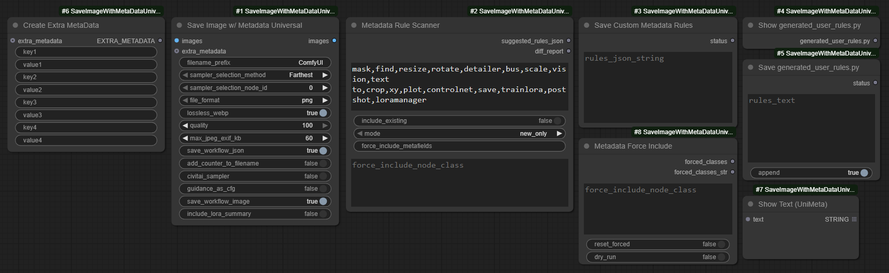
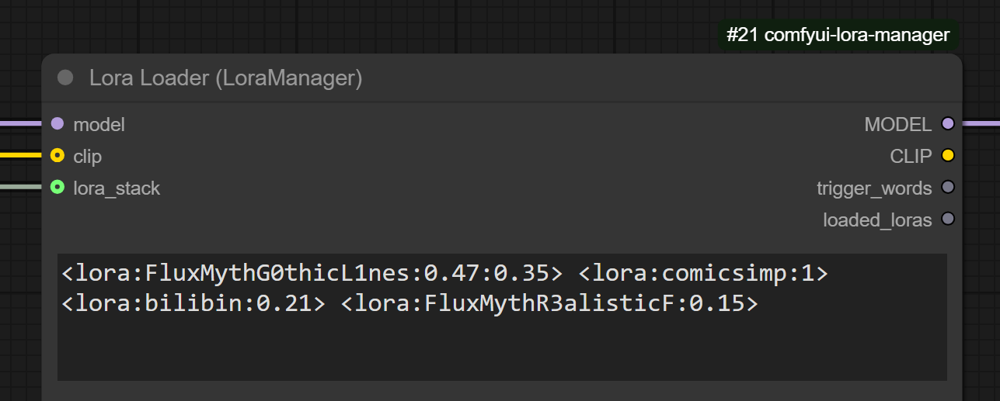

# ComfyUI-SaveImageWithMetaDataUniversal

> Enhanced Automatic1111‑style, Civitai-compatible metadata capture with extended support for prompt encoders, LoRA and model loaders, embeddings, samplers, clip models, guidance, shift, and more.

- An extensive rework of the [ComfyUI](https://github.com/comfyanonymous/ComfyUI) custom node pack [ComfyUI-SaveImageWithMetaData](https://github.com/nkchocoai/ComfyUI-SaveImageWithMetaData/), that attempts to add **universal support for all custom node packs**, while also adding explicit support for a few custom nodes.
- The `Save Image w/ Metadata Universal` node saves images with metadata extracted automatically from the input values of any node—no manual node connecting required.
- Provides full support for saving workflows and metadata to WEBP images.
- Supports saving workflows and metadata to JPEGs (limited to 64KB—only smaller workflows can be saved to JPEGs).
- Stores model hashes in `.sha256` files so you only ever have to hash models once, saving lots of time.
- Includes `Metadata Rule Scanner` and `Save Custom Metadata Rules` nodes, which scan all installed nodes and generate metadata capture rules
- Designed to work with most custom packs and fall back gracefully when a node lacks heuristics (I can't test with every custom node pack, but it has been working well so far).
- Since the value extraction rules are created dynamically, values output by most custom nodes can be added to metadata.
- Tested with SD1.5, SDXL, FLUX, QWEN, WAN (2.1 supported); GGUF, Nunchaku

## Table of Contents
<details open>
<summary><strong></strong></summary>

* Getting Started
  * [Quick Start](#quick-start)
  * [Format & Fallback Quick Tips](#format--fallback-quick-tips)
  * [Filename Token Reference](#filename-token-reference)
* Core Nodes & Features
  * [Nodes](#nodes)
  * [Feature Overview](#feature-overview)
  * [Node UI Parameters](#node-ui-parameters-key-additions)
  * [Sampler Selection Method](#sampler-selection-method)
  * [Metadata to be given](#metadata-to-be-given)
* Metadata & Encoding
  * [JPEG Metadata Size & Fallback Behavior](#jpeg-metadata-size--fallback-behavior)
  * [Metadata Rule Tools](#metadata-rule-tools)
* Advanced / Power Users
  * [Environment Flags](#environment-flags)
  * [Parameter String Formatting Modes](#parameter-string-formatting-modes)
  * [Ordering Guarantees](#ordering-guarantees)
* Reference & Support
  * [Troubleshooting / FAQ](#troubleshooting--faq)
  * [Design / Future Ideas](#design--future-ideas)
  * [Changelog](#changelog)
  * [Contributing](#contributing-summary)
  * [AI Assistant Instructions](.github/copilot-instructions.md)

  </details>

## Note
<details open>
<summary><strong>More:</strong></summary>

- I'm an amateur at coding, at best. I started writing this myself, but as I began increasing the scope of the project I started using a Copilot.
- If you have any questions, think any documentation is lacking, or experience issues with certain workflows or custom node packs, create a new issue an I'll try and see if it's something I can address.

</details>

## Installation
<details open>
<summary><strong>More:</strong></summary>

```
cd <ComfyUI directory>/custom_nodes
git clone https://github.com/xxmjskxx/ComfyUI_SaveImageWithMetaDataUniversal.git
```

</details>

## Quick Start
<details open>
<summary><strong>More:</strong></summary>

1. Use the `Metadata Rule Scanner` + `Save Custom Metadata Rules` nodes to create and save capture rules (see [`example_workflows/scan-and-save-custom-metadata-rules.png`](example_workflows/scan-and-save-custom-metadata-rules.png)).
2. Add `Save Image w/ Metadata Universal` to your workflow and connect to the image input to save images using your custom capture ruleset.
3. (Optional) Use `Create Extra MetaData` node(s) to manually record additional info.
4. (Optional) For full Civitai style parity enable the `civitai_sampler` and `guidance_as_cfg` toggles in the save node.
5. Prefer PNG (or lossless WebP) when you need guaranteed full workflow embedding (JPEG has strict size limits—[see tips below](#format-&-fallback-quick-tips)).
6. Hover any parameters on the nodes in this pack for concise tooltips (fallback stages, `max_jpeg_exif_kb`, LoRA summary toggle, guidance→CFG mapping, sampler naming, filename tokens). For further detail see: [Node UI Parameters](#node-ui-parameters-key-additions), [JPEG Metadata Size & Fallback Behavior](#jpeg-metadata-size--fallback-behavior); advanced env tuning: [Environment Flags](#environment-flags).

</details>

## Nodes
<details>
<summary><strong>More:</strong></summary>

| Node | Purpose |
| ---- | ------- |
| `SaveImageWithMetaDataUniversal` | Save images + produce enriched metadata (PNGInfo / EXIF) & parameter string. |
| `Create Extra MetaData` | Inject any additional custom key-value metadata pairs. |
| `Metadata Rule Scanner` | Scan installed nodes to suggest metadata capture rules (options for: exclude keywords, modes, metafield forcing). |
| `Save Custom Metadata Rules` | Save generated rule suggestions to `generated_user_rules.py` (append or overwrite). |
| `Show generated_user_rules.py` | Display the current merged user rules file contents for review/editing (optional). |
| `Save generated_user_rules.py` | Validate and write edited rules text back to the user rules file (optional). |
| `Metadata Force Include` | Configure global forced node class names for capture definition loading (optional). |
| `Show Text (UniMeta)` | Local variant for displaying connected text outputs; based on [pythongosssss](https://github.com/pythongosssss/ComfyUI-Custom-Scripts) `Show Text 🐍` (MIT). |
| `Show Any (Any to String)` | Display any connected value by converting it to a string; useful to wire ints/floats/etc. into `Create Extra MetaData`. |

</details>

## Feature Overview
<details>
<summary><strong>More:</strong></summary>

* Automatic1111‑style, Civitai-compatible parameter string (single‑line) with optional multi‑line deterministic test mode (`METADATA_TEST_MODE=1`).
* Dynamic rule generation: `Metadata Rule Scanner` + `Save Custom Metadata Rules` create and save user rules, allowing broad custom node coverage.
* LoRA handling:
  * Detects single and stack loaders & inline `<lora:name:sm[:sc]>` tags such as those used in [ComfyUI Prompt Control](https://github.com/asagi4/comfyui-prompt-control) and [ComfyUI LoRA Manager](https://github.com/willmiao/ComfyUI-Lora-Manager):
    <div style="width:60%;">
    
     
    </div>
  * Aggregated optional condensed summary line `LoRAs: name(str_model/str_clip)` plus per‑LoRA detailed entries (hashes & strengths retained even if summary hidden).
* Prompt encoder compatibility: handles multiple encoder styles (e.g. dual Flux T5 + CLIP) with aliasing and suppression of redundant unified positives.
* Full PNG + lossless WebP workflow + metadata embedding; JPEG with staged fallback under 64KB EXIF limit.
  * See detailed fallback staging: [docs/JPEG_METADATA_FALLBACK.md](docs/JPEG_METADATA_FALLBACK.md)
* Embedding name resolution & hashing with safe path normalization; model hash caching via `.sha256` sidecar files for speed after first run.
* Configurable guidance mapping (`guidance_as_cfg`) and sampler naming normalization (minimal, avoids unexpected renames) for Civitai compatibility.
* `Create Extra MetaData` node specifies metadata to be added to the image to be saved. Example: In [extra_metadata.json](example_workflows/extra_metadata.json).
* Selective verbosity: hide hash detail (`METADATA_NO_HASH_DETAIL`) and/or aggregated LoRA summary (`METADATA_NO_LORA_SUMMARY` or UI toggle).
* Stable field ordering for reproducible diffs & tooling.
* Runtime evaluation of env flags—restart not required for changes.
  * Environment flag reference: [Environment Flags](#environment-flags)
* Clear fallback signaling via `Metadata Fallback: <stage>` token in parameter string when JPEG trimming occurs.
* Wan 2.1 example workflow is available: [example_workflows/wan21_text_to_image.json](example_workflows/wan21_text_to_image.json). It demonstrates prompt encoding, WanVideo Sampler with combined "scheduler" input (parsed into Sampler/Scheduler), VAE decode, and saving with enriched metadata.
* Plays nicely with most custom node packs out‑of‑the‑box (in my somewhat limited testing).

</details>

## Format & Fallback Quick Tips
<details>
<summary><strong>More:</strong></summary>

* JPEG vs PNG/WebP: JPEG has a hard ~64KB EXIF ceiling for text data; large workflows trigger staged fallback trimming (see [detailed fallback](#jpeg-metadata-size--fallback-behavior)). Use PNG / lossless WebP for archival.
* Control JPEG attempt text data size: `max_jpeg_exif_kb` (default 60, max 64) caps EXIF payload before fallback (see [Node UI Parameters](#node-ui-parameters-key-additions)). (i.e. sets max text written to JPEG) before fallback stages engage.
* Detect fallback: If the metadata parameters string ends with `Metadata Fallback: <stage>`, this means max JPEG text data limit was hit and trimming occurred (`reduced-exif`, `minimal`, or `com-marker`) — see [Fallback Stages](#fallback-stages--indicator).
* LoRA summary line: Toggle with `include_lora_summary`. Adds an abbreviated summary of LoRAs used. If off, only individual `Lora_*` entries remain.

</details>

## Sampler Selection Method
<details>
<summary><strong>More:</strong></summary>

- Specifies how to select a KSampler node that has been executed before this node.
  - **Farthest** Selects the farthest KSampler node from this node.
  - **Nearest** Selects the nearest KSampler node to this node.
  - **By node ID** Selects the KSampler node whose node ID is set in `sampler_selection_node_id`.

</details>

## Metadata to be Captured
<details>
<summary><strong>More:</strong></summary>

- Positive prompt
- Negative prompt
- Steps
- Sampler
- Scheduler
- CFG Scale
- Guidance
- Denoise
- Shift, max_shift, base_shift
- Seed
- Clip skip
- Clip model
- Size
- Model
- Model hash
- VAE
  - It is referenced from the input of `Save Image w/ Metadata Universal` node, not KSampler node.
- VAE hash
  - It is referenced from the input of `Save Image w/ Metadata Universal` node, not KSampler node.
- Loras
  - Model name
  - Model hash
  - Strength model
  - Strength clip
- Embeddings
  - Name
  - Hash
- If batch size >= 2 :
  - Batch index
  - Batch size
- Hashes
  - Model, Loras, Embeddings
  - For [Civitai](https://civitai.com/)


---
</details>

## Filename Token Reference
<details>
<summary><strong>More:</strong></summary>

| Token | Replaced With |
|-------|---------------|
| `%seed%` | Seed value |
| `%width%` | Image width |
| `%height%` | Image height |
| `%pprompt%` | Positive prompt |
| `%pprompt:[n]%` | First n chars of positive prompt |
| `%nprompt%` | Negative prompt |
| `%nprompt:[n]%` | First n chars of negative prompt |
| `%model%` | Model base name |
| `%model:[n]%` | First n chars of model name |
| `%date%` | Timestamp (yyyyMMddhhmmss) |
| `%date:[format]%` | Custom pattern (yyyy, MM, dd, hh, mm, ss) |

Date pattern components:
`yyyy` | `MM` | `dd` | `hh` | `mm` | `ss`

---

</details>

## Node UI Parameters (Key Additions)
<details>
<summary><strong>More:</strong></summary>

Key quality‑of‑life and compatibility controls exposed by the primary save node:

* `include_lora_summary` (BOOLEAN, default True): Toggles the aggregated `LoRAs:` summary line; when False only individual `Lora_*` entries are emitted. UI setting overrides env flags.
* `guidance_as_cfg` (BOOLEAN, default False): Substitutes the captured `Guidance` value into `CFG scale` and omits the separate `Guidance:` field for better A1111 / Civitai parity when models expose guidance separately.
* `max_jpeg_exif_kb` (INT, default 60, min 4, max 64): UI‑enforced ceiling for attempted JPEG EXIF payload. Real-world single APP1 EXIF segment limit is ~64KB; exceeding it triggers staged fallback (reduced-exif → minimal → com-marker). For large workflows prefer PNG / lossless WebP.
* `suppress_missing_class_log` (BOOLEAN, default False): Hide the informational log listing missing classes that would trigger a user JSON rules merge. Useful to reduce noise in large custom node environments.

</details>

## JPEG Metadata Size & Fallback Behavior
<details>
<summary><strong>More:</strong></summary>

JPEG metadata is constrained by a single APP1 (EXIF) segment (~64KB). This repository enforces a hard UI cap of 64KB for `max_jpeg_exif_kb`; values above this provide no benefit and are rejected by Pillow or stripped by consumers. Large prompt + workflow JSON + hash detail can exceed the limit quickly.

When saving JPEG, the node evaluates total EXIF size vs `max_jpeg_exif_kb` (<=64) and applies staged fallback, attempting to write as much info to the EXIF as possible:
1. full (no message) — Full EXIF (workflow + parameters) fits.
2. reduced-exif — EXIF shrunk to parameters-only `UserComment`.
3. minimal — Trimmed parameter string (core fields + LoRAs + hashes) embedded as EXIF.
4. com-marker — EXIF dropped entirely; trimmed parameters stored in a JPEG COM marker.

If a fallback stage is used the parameters string gets an appended token: `Metadata Fallback: <stage>`.

Recommendations:
* Keep `max_jpeg_exif_kb` between 48–64 (the upper bound is enforced).
* Prefer PNG or lossless WebP when you require guaranteed full workflow embedding.
* Treat JPEG as delivery/export; archive originals as PNG if full metadata fidelity matters.

Limitations:
* Social platforms often strip both EXIF and COM markers; consider sidecar archival if critical.
* COM marker text has no structure; downstream tooling must parse the plain parameter string.
* Multi-segment APPn fragmentation (splitting across several EXIF/APP markers) is not implemented (deferred; see `docs/WORKFLOW_COMPRESSION_DESIGN.md`).
 * For more nuance on staged trimming: [docs/JPEG_METADATA_FALLBACK.md](docs/JPEG_METADATA_FALLBACK.md)

### Fallback Stages & Indicator
JPEG saves record a `Metadata Fallback:` stage when size constraints trigger progressive trimming:

| Stage | Meaning |
| ----- | ------- |
| `none` | Full EXIF (workflow + parameters) written within limit (stage not emitted) |
| `reduced-exif` | EXIF shrunk to parameters-only UserComment |
| `minimal` | Parameters string trimmed to minimal allowlist (prompt, negative prompt, core generation fields, LoRA entries, hashes) and embedded as EXIF |
| `com-marker` | All EXIF removed (too large); minimal parameters written into a JPEG COM marker |

When a fallback occurs the `Metadata Fallback: <stage>` marker is appended to the parameters string to aid downstream tooling.

NOTE: The `force_include_node_class` input is provided by the `Metadata Rule Scanner` node.

</details>

## Metadata Rule Tools
<details>
<summary><strong>More:</strong></summary>

The rule tooling consists of two cooperating nodes plus an optional scanner input:

### Scanner (`Metadata Rule Scanner`)
* Inputs: `exclude_keywords`, `include_existing`, `mode`, `force_include_metafields`.
* Scans installed nodes and suggests capture rules + sampler mappings.
* Produces JSON rule suggestions + a human‑readable diff summary.

### Force Include (`Metadata Force Include`)
* Inputs: `force_include_node_class` (multiline), `reset_forced` (bool), `dry_run` (optional bool).
* Maintains a global set of node class names treated as required when loading user metadata definitions.
* Output: Comma‑joined list of currently forced classes (`FORCED_CLASSES`).

You can connect the second plain `STRING` output (`forced_classes_str`) directly to `Show Text (UniMeta)` to display the active forced class list for auditing.

`SaveImageWithMetaDataUniversal` merges the forced class set before deciding whether to load user JSON definition files.

### Scanner Input: `force_include_node_class`
Optional multiline field accepted by the scanner. Provide exact class names (comma or newline separated) to forcibly include those nodes in scan results even if they:
* Match one of the `exclude_keywords`, or
* Would normally be omitted by `mode` (e.g. `existing_only` skipping additional nodes).

Output effects:
* `summary.forced_node_classes` lists them.
* `diff_report` appends a `Forced node classes=` segment.
* If a forced class yields no heuristic suggestions, an empty object is emitted so tooling can still merge or annotate it.

</details>

## Reference examples (JSON/Python)
<details>
<summary><strong>More:</strong></summary>

Reference-only files you can use as a guide when customizing rules. These are never loaded by the runtime as-is:

- `saveimage_unimeta/user_captures_examples.json` — JSON examples for capture rules. Copy snippets you need into `saveimage_unimeta/user_captures.json` to activate. Uses MetaField names as strings (e.g., "MODEL_HASH") and callable names as strings (e.g., "calc_model_hash").
- `saveimage_unimeta/user_samplers_example.json` — JSON examples for sampler role mapping. Copy into `saveimage_unimeta/user_samplers.json` if you need to map semantic roles ("positive"/"negative") to actual input names on sampler-like nodes.
- `saveimage_unimeta/defs/ext/generated_user_rules_examples.py` — Python examples mirroring the real `generated_user_rules.py` schema, including a `KNOWN` mapping for callables. This module is not imported by the loader and serves only as a reference.

Notes:
- Only `saveimage_unimeta/user_captures.json` and `saveimage_unimeta/user_samplers.json` are conditionally merged at runtime when needed.
- Python extensions in `saveimage_unimeta/defs/ext/` are loaded, except any module named `__*`, ending in `*_examples`, or `generated_user_rules_examples` which are intentionally skipped.

</details>

## Troubleshooting / FAQ
<details>
<summary><strong>More:</strong></summary>

### Why is my workflow JSON missing in a JPEG? 

The save exceeded `max_jpeg_exif_kb` and fell back to `reduced-exif`, `minimal`, or `com-marker`. Use PNG / WebP or lower the workflow size.

### I see `Metadata Fallback: minimal` — did I lose important info?  
Only non-core keys were trimmed. Prompts, sampler settings, LoRAs, hashes, seed, model & VAE info remain.

### Forced node shows up with empty `{}` in scanner output. Bug?  
No—`force_include_node_class` guarantees presence even if no heuristic rules match yet; use it as an anchor for manual rules.

### My LoRA summary line disappeared.  
Either `include_lora_summary=False` in the node or the `METADATA_NO_LORA_SUMMARY` env flag was set (UI param takes precedence).

### Parameter string suddenly multiline.  
Environment variable `METADATA_TEST_MODE=1` was set (intended for tests). Unset it for production single-line mode.

### Why are hashes missing detail JSON?  
Environment flag `METADATA_NO_HASH_DETAIL` suppresses the extended hash breakdown.

### How do I know which fallback stage occurred programmatically?  
Parse the tail of the parameters string for `Metadata Fallback:`. (A future explicit key may be added.)

### Metadata Rule Scanner doesn’t find the nodes I want to capture
- Check `exclude_keywords` on the scanner. If a class name or pack prefix matches, the scanner filters it out.
- Set `mode` to the broadest scan (e.g., include new + existing) and enable `include_existing` so suggestions merge with known rules.
- Use `force_include_node_class` (exact class names, comma/newline separated) to force discovery even if it would be filtered.
  - Tip: Find the exact class name via the node’s “type” in ComfyUI (or export workflow JSON and copy the class name).
- Use the `Metadata Force Include` node and wire its `forced_classes_str` to `Show Text (UniMeta)` to verify your forced list.
- If the node still doesn’t appear, open an issue with: node pack name, node class, your scanner inputs, and a minimal workflow.

### Scanner found my nodes but the suggested rules look wrong or fields are missing
- Treat the scanner output as a starting point. Some nodes require manual mapping of inputs to metadata fields.
- Open `Show generated_user_rules.py`, adjust the suggested capture paths to match your node’s sockets/fields, then `Save generated_user_rules.py`.
- Prefer explicit hints:
  - Use scanner input `force_include_metafields` to bias suggestions toward specific fields you care about first.
  - If your downstream needs Civitai-style names, enable `civitai_sampler` in the save node and `guidance_as_cfg` when appropriate.
- Sampler/scheduler mismatches: verify the node that actually did sampling (see Sampler Selection Method) and ensure its inputs are captured.
- LoRA/embedding not showing:
  - Ensure those loaders exist in the graph upstream of sampling and are not bypassed.
  - Inline tags like `<lora:name:sm[:sc]>` are detected; loader nodes may still need class forcing so they’re included in rule generation.
- Hashes missing: make sure models/VAEs/LoRAs are readable by the process; hash sidecars (`.sha256`) are used when present, else computed.
- Hash detail JSON absent: check that `METADATA_NO_HASH_DETAIL` is not set (UI parameter takes precedence where applicable).
- JPEG missing fields is not a rules error: it’s a size fallback. Use PNG/WebP or increase `max_jpeg_exif_kb` within the 64KB cap.

Quick checklist when metadata seems incomplete:
- Run the save with `METADATA_TEST_MODE=1` for deterministic multiline output and easier diffing.
- Temporarily set a small `max_jpeg_exif_kb` to exercise fallback stages and confirm minimal allowlist contents.
- Enable `METADATA_DEBUG_PROMPTS=1` to log prompt/alias capture decisions (review logs for skipped or aliased fields).
- Force‑include the node classes involved, rescan, and re‑save user rules; then verify with `Show generated_user_rules.py`.

</details>

## Advanced / Power Users
<details>
<summary><strong>More:</strong></summary>

### Design / Future Ideas
Deferred and exploratory concepts are documented in:
* `docs/WORKFLOW_COMPRESSION_DESIGN.md` (workflow compression placeholder)
* `docs/FUTURE_AND_PROTOTYPES.md` (archived prototype UI + additional speculative enhancements; Wan2.2 and multi-model workflow support)

### Environment Flags
| Flag | Effect |
| ---- | ------ |
| `METADATA_NO_HASH_DETAIL` | Suppress structured `Hash detail` JSON section. |
| `METADATA_NO_LORA_SUMMARY` | Suppress aggregated `LoRAs:` summary (UI `include_lora_summary` overrides). |
| `METADATA_TEST_MODE` | Switch parameter string to multiline deterministic format for tests. |
| `METADATA_DEBUG_PROMPTS` | Enable verbose prompt capture / aliasing debug logs. |

Additional Support:
* LoRA / model file extension recognition includes `.st` wherever `.safetensors` is accepted (hashing, detection, index building).

Precedence for LoRA summary: UI param `include_lora_summary` (explicit) > env flag > default include.

### Parameter String Formatting Modes
* Production: Single-line A1111-compatible string.
* Test: One key per line (stable ordering) when `METADATA_TEST_MODE` is set—facilitates snapshot diffing.

### Ordering Guarantees
Stable output characteristics to aid tooling & reproducibility:
* Stable ordering of captured metadata fields; new fields are appended only.
* Parameter string key order deterministic (single‑line & test multi‑line modes).
* Fallback marker (`Metadata Fallback: <stage>`) appended at most once and only when trimming occurred.
* JPEG fallback stage tracking aligns with documented progression (full → reduced-exif → minimal → com-marker).

### Changelog
- Refactor notice: legacy monolithic module removed; see [Changelog](#changelog) for new direct import paths.
See `CHANGELOG.md` for a summarized list of notable changes (e.g. JPEG fallback staging, 64KB EXIF cap enforcement, dynamic rule scanner separation, logging overhaul, documentation structure).

### Contributing (Summary)
Run lint & tests before submitting PRs:
```
ruff check .
pytest -q
```
See `CONTRIBUTING.md` for full guidelines.

AI assistants / contributors: see `.github/copilot-instructions.md` for architecture map, safe-edit rules, JPEG fallback constraints, and metadata field extension guidance before making automated changes.

---
For extended sampler selection details and advanced capture behavior, refer to the in-code docstrings (`Trace`, `Capture`) or open an issue if external docs would help.

</details>

日本語版READMEは[こちら](README.jp.md)。

